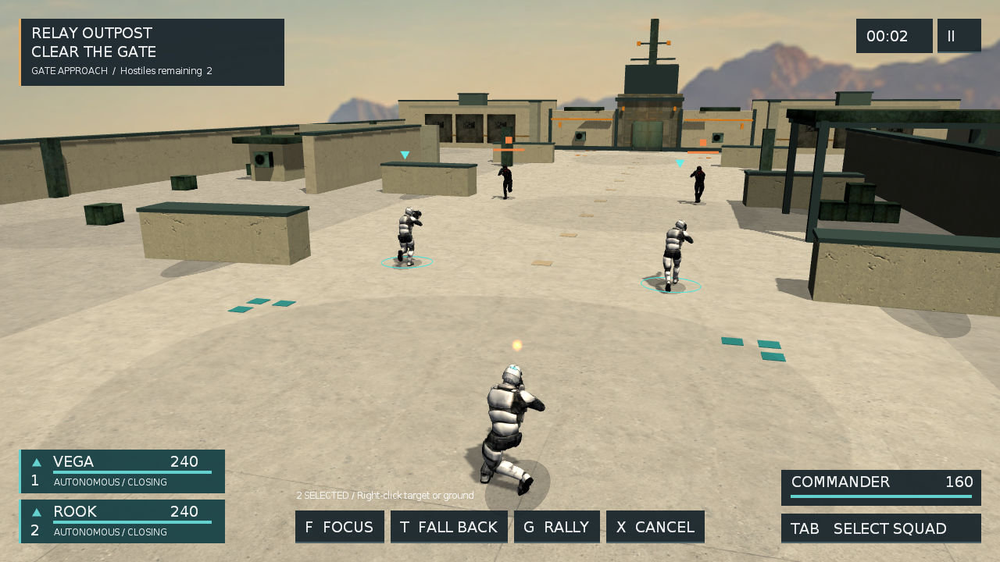

# Sandbox19 转向与输入手感改造

状态：本轮实现及 macOS 可执行验收已完成。人工硬件手感和 Windows 运行待验证。用户已要求直接实现一版。

## 目标与依据

参考本机 `/Users/lizi/Desktop/Workspace/MiniGame` 的 MiniwMacMain.mm、PCControl.cpp、ActorBody.cpp：视角使用独立相对增量，保留细小输入，身体朝向与镜头观察分开。现有 HelloOgre3D Q/E 为 143°/s、30Hz 逻辑步约 4.7°；macOS FOLLOW 转向使用 backing 像素位置差；移动与射击会在移动方向和镜头方向间切换。

## 实施

1. 输入：保留 UI 绝对坐标；FOLLOW 中键拖动改读原生相对位移并累计小数余量，不乘 Retina/窗口尺寸。按下、释放、失焦清理余量与持有输入，保持 FREELOOK 和命令鼠标合同。
2. 相机：FOLLOW 唯一视角状态由相机控制器持有，去掉仿真回写鼠标偏航的双状态。中键 0.12°/输入单位，Q/E 75°/s，逐渲染帧积分，释放立即停；暂停/退出重置输入。
3. 玩家：WASD 使用相机平面，移动和开火均面向视线；静止观察不强制转身。身体按最短角度短促跟随，避免横移/后退开火切换 90°/180°。首次开火等待基本对齐，子弹继续从当前真实枪口发出；保留 tank 模式和物理真源。
4. 验证：保存改前二进制回放；当前平台 Release 主程序 ABI clean rebuild；Sandbox19 输入回放、角色/镜头角度、暂停释放、命令边界与真实渲染截图；Sandbox6/7/8 回归。macOS 原生事件路径另做可执行探针，内部回放不冒充硬件手感。

## 所有权与范围

不增加 Lua API，不运行 tolua 生成器，不改第三方。相机服务/组件继续使用借用对象；native observer 在卸载时清理。身体方向写入现有 Bullet 刚体，渲染插值只读物理姿态。用户随后授权本地提交。本次纳入相机渲染时钟与静态遮挡、输入路由、姿态插值、侧步动画层及当前枪口求值等必要前置；其他 AI 行为、粒子、美术和场景改动保留在工作区。

## 验证结果

| 验证 | 结果与证据 |
|---|---|
| 工程/Release | `bash xcode.sh`；隔离主程序 `build/HelloOgre3D/obj/x64/Release` 后 arm64 Release BUILD SUCCEEDED，120个主程序编译单元重编；实际链接无 `_d.a`。未对含资源的 bin 执行 Xcode clean。 |
| 原生输入 | `tools/tests/native_follow_input.mm` 直接包含生产 Cocoa bridge，通过独立 listener doubles 接收结果：1×/2× × 960/1280/1920 六组均 PASS。400次(0.25,0.125)累计(100,50)，反向归零；绝对位置固定仍可转向；释放/失焦清余量和按键，滚轮不带转向，卸载 observer 不再回调。仅本地事件，无 OS 输入注入。 |
| Q轻按0.2秒 | 改前28.39°，改后15.21°；同段记录的最大渲染帧步幅4.727°→1.050°。20个显示帧中原来5帧改变方向，改后20帧均连续改变。两版松键尾转均为0°，本轮不把旧版已修好的尾转冒充新成果。 |
| 中键100单位 | 18.04°→12.01°（回放坐标量化后的快照角度）；按新输入比例精确值为12°。 |
| 侧移开火 | 身体朝向变化90°→0°；已查看移动和开火真实GL画面，侧步与枪口发弹保持可见。 |
| 180°/命令边界 | `tools/tests/sandbox19_control_feel.txt` + `tools/tests/check_control_feel.py <isolated stdout>` PASS：身体最大逻辑步17.82°，首发方向175.92°接近180°目标；后退开火、跨±180°微调、Q/E抵消、暂停清按键、俯仰方向、框选排斥中键均通过。 |
| sample回归 | Sandbox19产品/场景自测、Sandbox6/7/8 各15秒 Release smoke PASS；不是完整通关或长时稳定性验收。 |
| 精确暂存版本 | 从暂存区导出主程序源码和 Lua 脚本，复用当前资源、现有 Release 静态库及生成工程；隔离目录120个主程序编译单元全部重编并链接成功。9项控制边界回放 PASS，Sandbox6/7/8 各15秒 PASS，两份 Lua 5.1语法通过。现有 bin/HelloOgre3D 哈希未变。 |

[结构化测量](../specs/assets/sandbox19-control-20260912/measurements.json)。本地完整证据：`tmp/control-feel-20260912/`、`tmp/experience-fixes-20260912/control-before-desktop/`、`control-after/`、`control-edges/`，以及 `tmp/m1-smoke-20260912-153341/`。构建哈希记在 measurements.json。精确暂存版补充证据位于 `tmp/control-feel-20260912/isolated-main-build.log`、`isolated-run-summary.log` 和 `isolated-results/`；该验证没有把未提交的美术资源纳入提交。该轮共享 Sandbox.log 曾混入别的实例回放，最终统计使用各子进程独立 stdout.log，未把混入行纳入结果。



## 限制与取舍

- 这是面向视线的第三人称操作：A/D侧移、S后退，不自动转身朝位移方向跑。大幅自由环绕后第一次开火需要短暂转身（180°探针约0.4秒后发出首发），避免在旧身体方向发弹；持续动作仍按真实枪口射击。
- 本轮只借鉴 MiniGame 输入与方向分工，没有移植其整套头部/身体骨骼控制。沿用现有侧步/后退动画及枪口姿态。
- AppKit 原生探针确认屏幕相对增量(5,7)在 NSEvent 中仍为(5,7)，本项目俯仰方向无需照搬 MiniGame 的Y反号。
- 沙箱内 OpenGL 初始化失败、Xcode module cache 写入失败；改在获准的桌面/构建环境完成验证。后台窗口禁硬件输入且不抢焦点。内部回放与桥接探针不等于真人鼠标/触控板手感；Windows条件编译路径未引入平台专属调用，但尚无本轮Windows构建/运行证据。

## 复跑入口

macOS 原生转换探针（不显示窗口或投递系统输入）：

```bash
xcrun clang++ -std=c++17 -fno-objc-arc -Isrc/HelloOgre3D/sandbox -Isrc/external/ois/includes -Isrc/Engine/ogre3d/include tools/tests/native_follow_input.mm -framework AppKit -o /tmp/native_follow_input
/tmp/native_follow_input
```

图形会话内，在仓库根目录启动后台回放（绝对路径按实际 checkout 调整）：

```bash
(cd bin && HELLO_SANDBOX_SAMPLE=Sandbox19 HELLO_WINDOW_BACKGROUND=1 HELLO_AUDIO_SILENT=1 HELLO_CAMERA_TRACE=1 HELLO_INPUT_REPLAY=/Users/lizi/Desktop/HelloOgre3D/tools/tests/sandbox19_control_feel.txt ./HelloOgre3D) > /tmp/control-feel.log 2>&1
python3 tools/tests/check_control_feel.py /tmp/control-feel.log
```

运行时由回放主动退出；检查器只有完成标记、禁硬件输入标记及全部行为断言通过才输出 PASS。示例固定采用当前默认30Hz仿真；采样精度与模型的 authored muzzle cant 允许小量角度误差。
