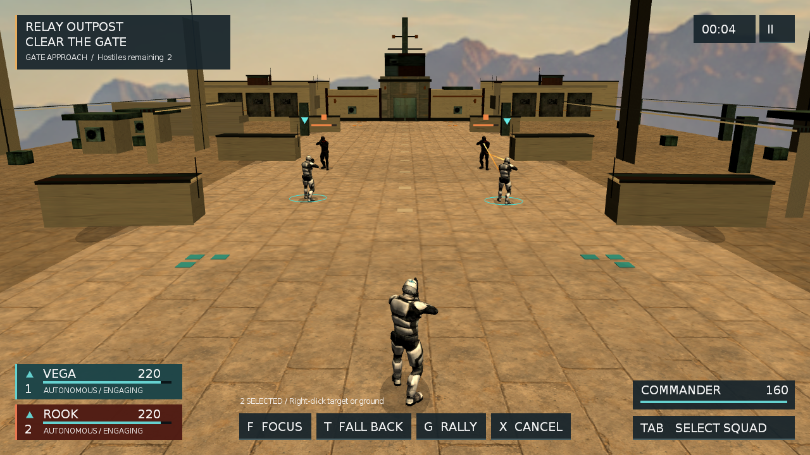

# Sandbox19 院区建筑剪影与空间层次

日期：2026-09-12
状态：北侧建筑剪影切片已完成；整体 P3 视觉品质仍未完成

## 问题与目标

对照当前 1280×720 GL 实机和获批概念稿，现有门楼只占远景中间一小块，低矮后墙把大片天空和空地留给画面；近处虽有可碰撞掩体，远端仍像孤立的盒子。先用项目已有的混凝土、门面和设备资源构成连续的北侧院区立面，在不挪动玩家/守卫出生点、不堵住中路与西侧绕行路线的条件下改善构图。

## 本轮实施边界

- 只在既有北侧建筑与边界墙占地内增加两翼建筑、层次清楚的压顶和少量门窗/设备，保留中央可识别的 relay 门厅与信号状态。避免把大量箱子堆到交火区，或借固定视角的 2D 假背景冒充完整三维建筑。
- 建筑补件与物理体保持同尺寸；新增可步行区附近碰撞前重新验证 navmesh、视线和清场行为。场景材质沿用专用 `Relay/*`，不更改共享基础材质。
- 以相同输入回放的真实 GL 抓帧对比开场和接近门楼的两个时刻；只有构图确实更好、没有明显穿插或光照伪影才保留。

## 验证与剩余缺口

验证：Lua 语法、Sandbox19 导航/碰撞自测、无测试生命的两波自然推进、产品 fixture 和相关 smoke、`git diff --check`。本轮仅改善场景结构，不把旧角色/武器造型、PBR 缺口或人工手感判为已完成；Windows/D3D9 无环境时列为未运行。

## 结果（2026-09-12）

- 北边界后墙从 2.4 米提高到 4.2 米；在原有建筑和边界占地内增设浅色双翼、屋顶设备、低饱和赭色水平线与两个门厅侧柱。初版窗带以黑色小 Box 表示，后用仓库现有 `modular_concrete_small_window_1.mesh` 六块实体窗格替换，使用中性 `Relay/ServiceWindow` 材质。每块网格 2.56 米见方，间距 3 米，嵌在原有实体建筑前壁内，不占主路。中门维持较深的设备门面色，三层高度关系在 1280×720 正常跟随镜头可见。前后对照：原图 `tmp/sandbox19-shadows-off-probe-20260912/no_shadow_05000ms.png`，终版图 `tmp/sandbox19-window-spaced-probe-20260912/spaced_05000ms.png`。25/40 秒近门图在 `tmp/sandbox19-window-final-longrun-20260912/`，未观察到建筑相互穿插或角色被新建筑挡在门外。

- 同场景尝试在东西侧增加高设备楼，GL 抓帧显示边缘出现突兀的高板，已撤回该试验结构。临时 `HELLO_RENDER_SHADOWS=1` 的 stencil 阴影对照能正常运行，但开/关抓帧中几乎没有可见收益；进一步用较低日光角度测试也只让地表变暗、未形成目标稿式长投影。又将光向翻向镜头并提高环境光试验，`tmp/sandbox19-inverse-shadow-probe-20260912/inverse_05000ms.png` 显示北面主体变黑、地面仍无有用长投影，因此同样撤回，未改阴影默认开关。若要目标稿式阴影，需要先解决当前 forward 材质/投影链，而不是仅调角度。
- 首段队友站位也做过独立探针：把出生点从 x=±3 推到 ±6、±5 并放宽友军射击/停步距离后，右队友长时间 READY、不稳定开火；只保留射程变化时双方能交战，但画面几乎没有改善。该试验的 Lua 参数与出生点已全部撤回，不把测试改动留作“战术提升”。
- 扩大并偏移六块掩体的现有柔和接地遮罩也做过短探针，`tmp/sandbox19-ground-shadow-probe-20260912/cast_05000ms.png` 只形成更宽的模糊色块，未补上有方向的真实投影，已撤回；继续堆贴地椭圆并非可靠的光照升级。
- 将左侧三段旧屋顶网格临时替换为连续浅色 Box 屋面，`tmp/sandbox19-canopy-probe-20260912/canopy_05000ms.png` 中仅留下远处细横条，不能形成参考图的近景棚体层次，也已撤回。下一轮棚体改造须先处理镜头内位置与可信的篷布/框架资产。
- 窗格网格先试了亮色 `Relay/Window`、直接混凝土 albedo 与暗色 `Relay/Trim`，分别显得像贴片、纹理消失或整片黑洞；最终选中性 tint 并拉开相邻网格间距，避免两个 2.56 米面片按 2.5 米间隔交叠。对应 GL 对照保存在 `tmp/sandbox19-window-{mesh,concrete,trim,service,spaced}-probe-20260912/`。
- 为排除 scene compositor 吞掉 stencil 投影，又在默认日照和 `HELLO_RENDER_SHADOWS=1` 下只临时停用 `Relay/SceneGrade` 对照 `tmp/sandbox19-stencil-compositor-{on,off}-20260912/`。日志确认 on 组启用、off 组不可用，两个实机画面都没有可读的方向投影，说明根因不能归给合成纹理本身；临时代码已撤回，仍未把 stencil 阴影打开为默认。
- 首对低掩体从 `x=±8.3,z=-8.5` 临时移至 `x=±6.5,z=-10` 后，`tmp/sandbox19-near-cover-probe-20260912/cover_05000ms.png` 中它们更占画幅，却落在已向前接敌的队友身后，既没有成为战术遮蔽又使空地更局促；已撤回。若要参考图中“队友依掩体作战”，需要同步设计 AI 停位/射界，而非单改箱子位置。
- `/usr/local/bin/luac -p` 解析 scene Lua 通过；60 秒真实 GL 内部输入回放沿原路线推进，首波 12.936 秒、第二波 17.919 秒、36.597 秒 REGROUP、40.359 秒 VICTORY，正常退出，无 STALEMATE，完整日志保存在 `tmp/sandbox19-courtyard-longrun-20260912/Sandbox19.log`；这是合成输入，不是人工手感。产品 fixture `tmp/relay-product-fixture-20260912-105618-sztkatx0/summary.json` 为 `PASS reason=evidence-complete synthetic=true`，七个出生点、直路/西路、墙/掩体/地面 Bullet 射线均通过。15 秒 Sandbox19 smoke 返回 PASS，证据为 `tmp/m1-smoke-20260912-105949/Sandbox19.log`。四个既有 base.program 参数 warning 仍在日志中，与本次建筑改动无关；未新增场景资源错误。
- 窗格和配对法线最终版本又独立跑了产品 fixture `tmp/relay-product-fixture-20260912-121322-_ajnl49n/summary.json`，`PASS reason=evidence-complete synthetic=true`，出生、直路/西路与实体射线断言未回退。无强化 60 秒真实 GL 回放日志和 5/25/40 秒抓帧在 `tmp/sandbox19-window-final-longrun-20260912/`：首波 12.936 秒、第二波 17.919 秒、36.762 秒 REGROUP、40.392 秒 VICTORY，无 STALEMATE，正常退出；仅为合成输入。日志确认新窗格网格加载，未出现新 shader/纹理异常。此前提到的四条 `base.program` 无效自动参数 warning 已由同轮 GL shader 修正消除，不能再当作当前日志状态；详见[法线计划](2026-09-12-sandbox19-normal-lighting.md)。

本轮没有新增高品质角色、武器或建筑模型。远景宽度与明暗层次有所改善，但概念稿的资产细节、真实阴影和完整环境密度尚未达到，不能把这次结构切片当成整体产品级视觉验收。
