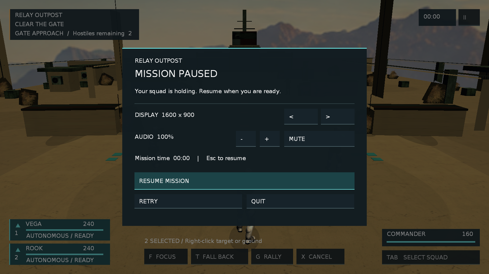

# Sandbox19 动态窗口与多分辨率收口

日期：2026-09-12
状态：完成（macOS 实机；Windows 运行待对应平台复核）

## 目标

关闭 P3 中“macOS 普通窗口固定 1280×720、动态窗口未验”的缺口。Sandbox19 应能从暂停菜单在 1280×720、1600×900、1920×1080 三档 16:9 窗口间切换并保存选择；启动环境覆盖应跨 Windows/macOS 生效。窗口变化后，相机宽高比、Gorilla HUD、FairyGUI、输入范围与 Relay/SceneGrade compositor 必须跟随新尺寸，不裁切、不拉伸、不产生 UI 重影。

## 设计与边界

- `ClientManager` 统一读取合法的 `HELLO_WINDOW_WIDTH/HEIGHT`。macOS 用请求值设置初始 Video Mode；Windows 普通窗口继续经过 DPI 物理像素换算，后台工具窗口保持其既有“明确物理像素”契约。窗口日志同时记录请求值与 Ogre 实际内容尺寸，不能把操作系统约束后的尺寸伪报成请求值。
- `GameManager::RequestWindowSize` 只接受 640–3840 × 360–2160 的逻辑内容尺寸，并把请求排到下一帧安全点执行，避免 Lua 鼠标回调内同步触发 Cocoa resize 通知而重入脚本 VM。
- 暂停菜单提供三档 DISPLAY 选择。`relay_settings.cfg` 继续是数字/布尔纯数据，新增 `window=宽x高`；显式启动尺寸优先于保存值。Windows 后台自动化拒绝运行时 resize，防止离屏窗口尺寸变化后覆盖桌面。
- 本轮不加入全屏切换、任意分辨率输入、渲染比例、动态分辨率或跨显示器管理；它们需要单独的显示设置设计。

## 实施结果

- `ClientManager::RequestWindowSize` 只登记一笔最新请求，`FrameRendering` 下一帧执行 Ogre resize；`WindowResized` 继续同步输入范围、Lua/UIManager、FairyGUI root、viewport 与相机宽高比。FairyGUI 原生 screen/root 先更新，再通知会查询该值的 Lua `FairyGuiManager`，避免动态 resize 当帧按旧尺寸重排。
- `GameManager::RequestWindowSize` 通过 `GameManager.h` 的 tolua 区域和手术式 `GameToLua.cpp` 绑定导出，没有运行全量 tolua 生成器。
- Sandbox19 暂停层增加 DISPLAY 行和前后切换；`sandbox19_audio.lua` 集中持有 1280×720、1600×900、1920×1080 三档、实际窗口观察值与 `relay_settings.cfg` 的 `window=宽x高`。启动环境覆盖优先并锁定控件，保存值在普通启动后延迟应用；后台自动化不消费保存值，避免改变既有固定尺寸测试。
- Windows 后台窗口拒绝运行时 resize；普通窗口仍走 DPI 物理像素换算。当前没有 Windows 会话，因此只完成条件编译路径与 API 契约静态核对，不把 Windows 构建或运行记为通过。

## 验证结果

| 检查 | 结果 | 证据与边界 |
|---|---|---|
| Lua / 绑定同步 | PASS | `/usr/local/bin/luac -p` 解析三个改动脚本；头文件、`GameToLua.pkg` 的 `$cfile`、手术式绑定函数/注册和 Lua 调用点一致。运行时由内嵌 Lua 5.1 实际消费新 API。 |
| macOS Release | PASS | Apple Silicon arm64 Release 构建完成；本轮没有 ABI 布局变更，无需 clean rebuild。 |
| 同进程动态切换 | PASS | `tmp/window-dynamic-final-20260912/`：实际抓帧从 1280×720 变为 1600×900；日志依次出现 queued、`Sandbox19Display accepted`、applied，暂停层、HUD、场景后处理均完整重排且应用正常退出。 |
| 保存与重启读取 | PASS | `tmp/window-persistence-1600x900-20260912/`：普通启动先创建 1280×720，读取保存值后排队并实际变为 1600×900，内部回放正常退出；测试结束已恢复原 `volume=1.00 / muted=0`。 |
| 启动覆盖与禁用态 | PASS / 受显示器约束 | `tmp/window-1080-final-20260912/` 请求 1920×1080；本机 macOS 标题栏窗口受可见工作区限制，实际内容为 1920×945。暂停层显示实际尺寸并锁定切换，画面无裁切或重影。该证据证明覆盖优先级和真实尺寸上报，不证明本机得到 1080 行内容。 |
| FairyGUI 多尺寸 | PASS | `tmp/fgui-screen-adapt-1600x900-20260912/` 在实际 1600×900 下验证居中弹窗、边缘弹出层、引导遮罩和 Toast 均在屏内，结果 `true`；该自测模式按约定跳过 Sandbox 场景，与 HUD 动态切换证据分开。 |
| 玩法与章节回归 | PASS | 最终产品 fixture：`tmp/relay-product-fixture-20260912-081628-ao4a0iay/summary.json`；Sandbox19/6/7/8：`tmp/m1-smoke-20260912-081650/`，四项均 PASS。受限进程首次 fixture 因无 OpenGL 3 上下文失败，随后在真实图形会话复跑通过，未把环境失败计入产品结果。 |
| Windows / D3D9 | NOT RUN | 新增 `_WIN32` 路径已静态核对，但当前 macOS 无法构建或运行 VS2017/D3D9；Windows 普通窗口的动态 resize 与新 DISPLAY 菜单仍需对应平台复核。 |

已知 GL `base.program` 对未使用常量的四条 `InvalidParametersException` 是本项目现存启动噪声，以上 runner 继续按既有口径忽略；本轮新增 Relay/SceneGrade、窗口请求和 Lua 链没有新的编译或运行错误。动态抓帧使用内部 InputReplay，证明应用输入路由和布局，不替代人工持续输入、手感或扬声器听感。
