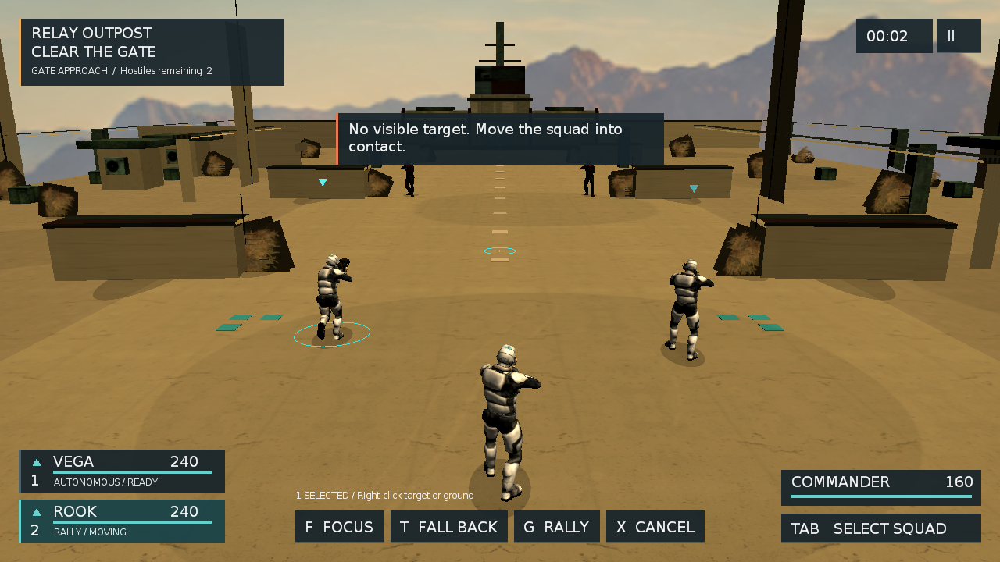

# Sandbox19 场景色调与 UI 合成隔离

日期：2026-09-12
状态：已完成

## 目标

在不改玩法、材质真源和 HUD 设计色的前提下，为 Sandbox19 增加一层克制的最终场景色调：拉开明暗与材质分离，统一荒漠冷暖关系，并用轻微暗角把注意力收回交战区。后处理只作用于三维场景；Gorilla 与 FairyGUI 必须在最终 viewport 保持清晰、原色且只绘制一次。

## 关键设计

- Relay/SceneGrade compositor 把主 viewport 的三维结果写入 PF_R8G8B8A8 scene texture，再由全屏 shader 执行轻量 S 曲线、低幅饱和度提升、冷阴影/暖高光与 6.5% 边缘暗角。GLSL 150 与 HLSL 2.0 保持同一组常量。
- scene target 使用 0x7fffffff 可见掩码，FairyGUI manual object 使用 0x80000000，使 UI 不进入场景纹理、而在最终 viewport 正常绘制。Gorilla 是 render-queue listener，不能仅靠可见掩码隔离；Screen::renderQueueEnded 还需核对 render system 当前 active viewport 与创建该 Screen 的 viewport。
- SceneService::SetCompositorEnabled(name, enabled) 负责按相机 viewport 幂等查找、添加和切换 compositor。Lua 使用手术式 tolua 同步，Sandbox19 初始化时启用；资源缺失时返回 false 并记录日志，不影响其它 sample。
- 这不是 HDR、色调映射或 PBR 管线，也不把 HUD 一并滤色。固定 LDR 参数服务当前关卡美术方向；未来若引入动态曝光，应另行设计。

## 实施结果

- 新增 compositor、material、unified program 及 GLSL/HLSL shader；Sandbox19 启动日志明确记录 Scene compositor Relay/SceneGrade enabled。
- 首版实机抓帧暴露出 Gorilla listener 在 scene RTT viewport 重复绘制，形成倒置 HUD 并在最终画面叠加。active viewport 守卫修复后，准备模态、常规 HUD、文字和矢量标记均只出现一次；FairyGUI 最终视图可见位通过完整自测。
- 最终调色保持低幅：混凝土与地表层次更清楚，阴影略冷、relay 与天空高光略暖，边缘收束但不压黑植被和掩体。

## 验证

- macOS arm64 Release 重新编译并重链接通过；生成的主 target 实际链接 _d 依赖代理，因此先显式重建 libogre3d_gorilla_d.a，再触发主程序重链接，避免旧静态库造成假通过。
- /usr/local/bin/luac 5.3 对 Sandbox19.lua 解析通过；当前机器没有独立 Lua 5.1 parser，游戏内嵌 Lua 5.1 已在产品 fixture、smoke 和真实抓帧中实际调用新增绑定。
- python3 tools/run_sandbox19_stability.py --product-fixture --timeout 90 --executable bin/HelloOgre3D 返回 PASS reason=evidence-complete，证据位于 tmp/relay-product-fixture-20260912-005627-xuk1ahd6/。
- python3 tools/run_m1_smoke.py --samples Sandbox19 Sandbox6 Sandbox7 Sandbox8 --seconds 20 四项均 PASS，证据位于 tmp/m1-smoke-20260912-005647/。
- Apple M1 Pro / OpenGL 4.1、1280×720 最终抓帧位于 tmp/product-grade-post-final/；日志解析 compositor、program 与 shader 且无 relay shader 错误，截图确认无倒置/重影。现有 base.program 常量 warning 与本轮无关，继续保留。
- FairyGUI All 自测 30 / 30、长循环 3 / 3 且 finalClean=true，本地证据为 tmp/fgui-compositor-visibility-20260912.log。

## 保留边界

HLSL/D3D9 本轮未在 macOS 验证；最终人工持续输入手感、扬声器听感和动态窗口仍未验。角色仍是旧低多边形资产，场景材质仍非 PBR；本轮只关闭“无后处理”的缺口，不据此把 P3 总体验标为完成。
