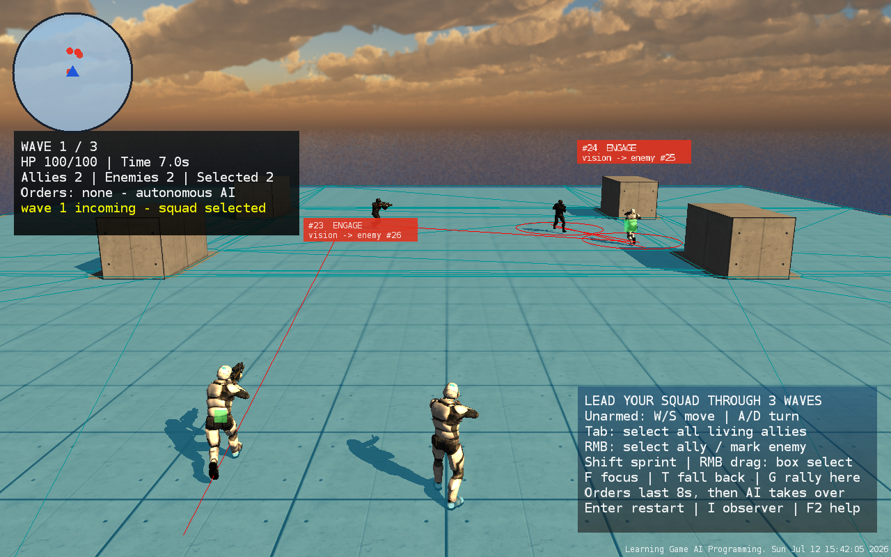
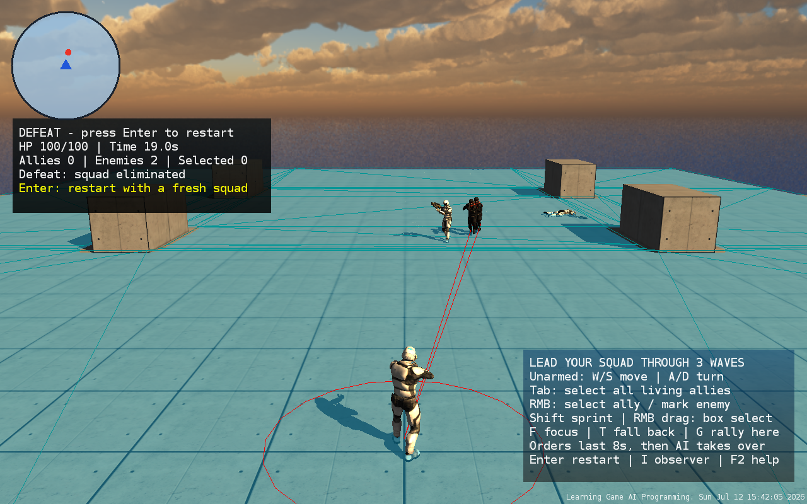
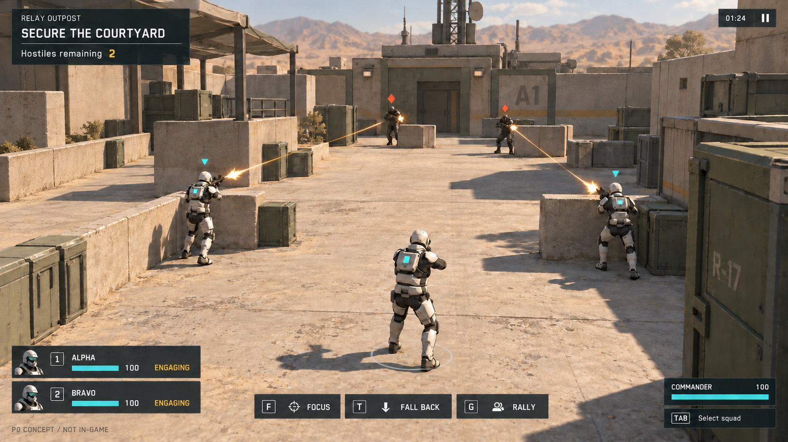
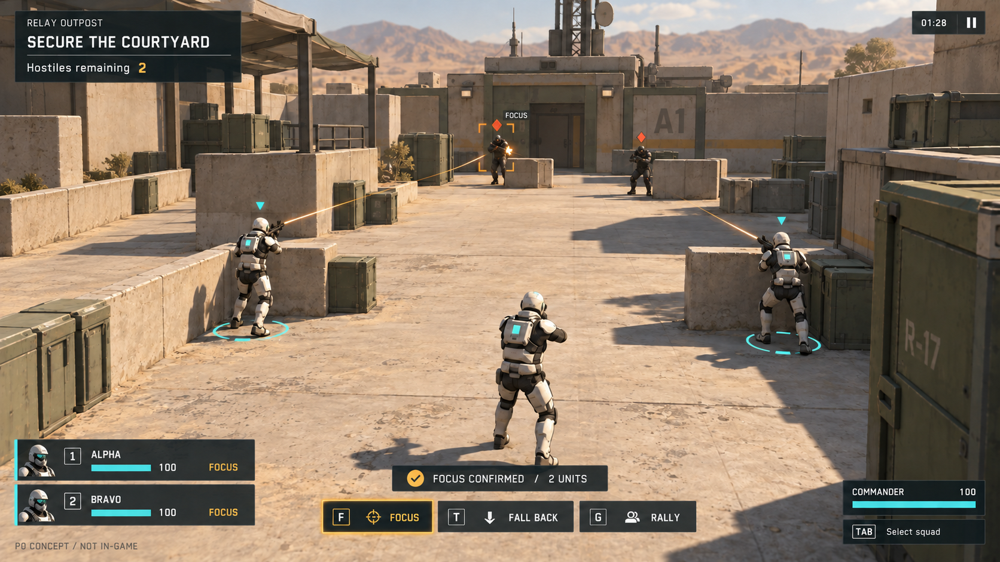
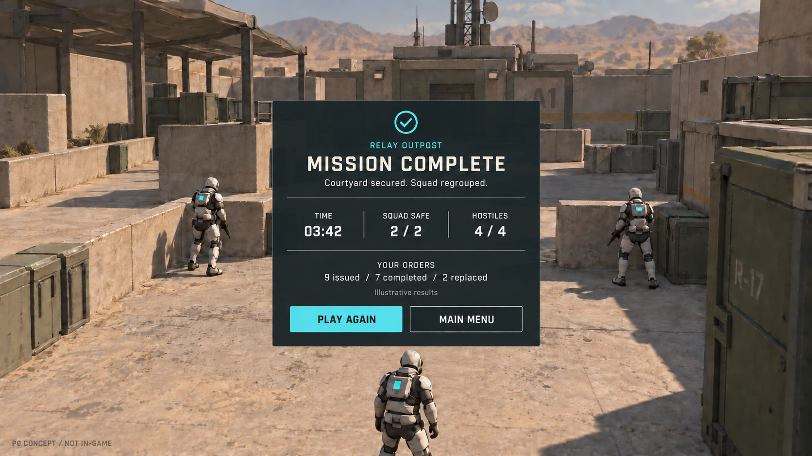

# Sandbox19：已批准的玩法与整体视觉设计（含 P0 历史基线）

日期：2026-09-10。用户已明确反馈：“这套玩法与视觉都非常棒，就按照这套实施吧”。伴随式小队指挥、中继站短任务、浅暖工业场景与紧凑 HUD 已获批准，P1–P3 持续实施，无需再次等待方向确认。当前实现与后续证据见 [当前实现与验收记录](../../playtest-relay-2026-09-10.md)；下述 P0 工具失败及未执行项保留原时间范围，不作为当前状态。上位计划见 [联合推进计划](../plans/2026-09-10-sandbox19-product-experience.md)，玩法见 [一页说明](2026-09-10-sandbox19-core-loop.md)，进度见 [cycle](../../cycle-01.md) / [backlog](../../backlog.md)。

## 1. 已批准方向

采用“中继站行动”：无武器指挥官伴随两名 AI 队友，通过观察、选择路线和下令完成一场短任务。采用较高的第三人称跟随视角、日光下的浅色混凝土哨站和紧凑深色 HUD。场景强调可识别的入口、通道、遮挡和终点，角色与战况处于视觉中心。

选择这一方案是因为现有士兵、模块化建筑、物理/导航和小队指令可复用；单层小场地避免新建多层导航；保留指挥官和跟随镜头减少立即转为纯 RTS 的控制重构。相较现有场景，必须做实的变化是空间组织、信息层级、命令含义和任务流程。

较高的跟随相机仍可能受遮挡影响，P1 需与现有参数在同一场地实测。若角色遮挡和镜头操作仍占据过多注意力，再比较固定高位指挥视角；这不是已经确定的替换。浅暖工业哨站风格已获作者认可；仍须按实际截图核对实现效果。

## 2. P0 实施前真实基线（2026-09-10，获批实施前）

P0 基线从当时源码（HEAD `a1ed61f`，该次运行源码未修改）生成 VS2017 工程并完成 Windows Release x64 构建，未修改游戏源码。随后使用真实 D3D9 窗口与仓库已有 `RuntimeRenderCapture` 输出渲染截图。普通模式，没有 smoke、自测杀敌或自动命令注入。

直接可见的问题：

- 天空和远方水面占据较大上部区域；地板、独立方块与平台边缘缺少完整地点的空间组织。
- 导航三角线、红色连线和角色环长期显示，与战斗识别竞争注意力。
- 头顶卡片有对象 id、Vision 等调试表达，遮挡战斗且敌我语义不统一。
- 大块帮助和状态文字固定占据左侧与右下；缺少稳定、可点击的两名队友入口。
- 当前“失败”主要是 HUD 文字变化，场景还在继续活动，没有独立结算交互层。

有记录的两次截图基线分别于第一波 19.008 秒、15.609 秒自然战败。它们只证明这两次静止指挥官普通过程的结果，不代表整个玩法难度分布。没有用它们证明玩家指挥是否有效。

## 3. 三张目标画面（概念稿）

以下图片由内置 imagegen 生成，作为构图、配色、UI 层级和交互状态的目标稿，**不是当前游戏截图，不是可操作原型**。结算数字为示例。生成提示与迭代说明见 [提示记录](assets/sandbox19-p0/image-prompts.md)。

### 正常战斗

目标：实际场地占据主要视野，两名队友和敌方入口同时可见；上方只显示任务、底部承担队伍与命令，中心保留给战斗。友军青色三角、敌人橙色菱形，形状与颜色双重区分。

### 选中并下达集火

目标：地面选择环、队友卡选中边、目标框、命令按钮和短暂确认表达同一次操作。确认只表示命令已被接收；持续执行、目标丢失和完成采用另外的状态，不把点击成功当作命中成功。

### 任务结算

目标：使用同一场地作为背景，停止战斗，深色面板突出结果、关键统计与重试。失败复用同一布局，使用“指挥官倒下 / 小队阵亡 / 任务中断”等实际原因；没有经验、星级或未实现的成长奖励。

### 概念稿与实现的对应限制

三张图约为 16:9 视觉目标，不是固定像素布局规格。生成图中的新盔甲细节、箱体倒角、布棚和远山属于造型参考：P1 先复用既有士兵骨骼和建筑模块，用模块轮廓、少量自制道具、贴图与静态背景完成相同层次。原始草图中的楼梯已从选用版本移除，避免承诺多层通路。

必须兑现的是视野结构、敌我可读性、统一材质色调、HUD 层级和操作反馈；具体模型不要求逐像素复制生成图。图中景深/远景柔化不是引擎功能承诺，正式目标不依赖景深、光追、体积雾或新 PBR 管线。新角色资产和定制动画若成为明确要求，需要单列成本，不能靠贴图生成代替可用的骨骼模型。

## 4. 视觉与交互规范

| 项目 | 首版规范 | 验收方法 |
|---|---|---|
| 配色 | 面板 `#17242B`，正文 `#F1EDDF`，友军/选择 `#65D1CF`，目标强调 `#E7AE61`，敌人/危险 `#E97750` | 敌友还带不同形状；危险不靠大面积红底长期闪烁 |
| 材质 | 暖灰混凝土、浅砂地面、低饱和灰绿金属三类主材；少量磨损和区域编号 | 同一材质缩放和纹理密度一致；装饰不能掩盖可行走边界 |
| 光照 | 一盏方向光和环境补光，保留简洁可读的接触阴影 | 在实际 D3D9 和后续 macOS 路径分别核对；不假设两平台默认阴影相同 |
| 几何 | 单层通路、低遮挡体、简洁建筑轮廓；边界用墙/地形接住，避免浮空平台 | 视觉、碰撞和导航一致；装饰不会形成意外窄缝或不可达区域 |
| 字体 | 标题用清晰窄体效果、正文用无衬线；参考 1280×720 时正文约 16px、标题 24–28px、辅助 13–14px | 以实际像素与 DPI 测试调整；第一版英文稿沿用现有内容语言，中文需要单独验证字体链 |
| 排版 | 8px 间距基准、屏幕安全边距至少 20px；主要信息只放一个位置 | 1280×720 / 1920×1080 以及窗口调整后无裁切、重叠和点击偏移 |
| 战斗 HUD | 上方任务与暂停；左下两张队友卡；下方情境命令；右下指挥官状态 | 当前状态清楚，操作可点击；雷达是否保留由镜头外信息需要决定 |
| 场景标记 | 选中环、简洁友军/敌人形状和目标框；必要短标签 | 不显示未知敌人的真实位置；不将射线/导航 debug 当正式标记 |
| 控件状态 | 默认、hover、pressed、selected、disabled、pending/failed | 禁用状态给原因；确认提示短暂出现，执行状态留在队友卡 |
| 动效 | 小范围渐显/边框过渡约 100–160ms；确认约 1.5s；伤害短闪 | 以真实状态转换驱动；不靠夸张缩放、屏幕抖动干扰指挥 |
| 音效 | 先做点击、确认、失败、枪声、命中、结算六类短音；可静音与调音量 | 重复事件限频，场景卸载停止声音；音频模块未实现前不能标通过 |

HUD 同时显示的信息总量要降低，但不会以缩小到不可读字号实现。AI 观察面板保持按需打开，关掉诊断不改变命令维护和玩法行为。

## 5. 资源复用、替换与制作清单

成本为本项目内相对集成复杂度，不是工期承诺。许可栏只记录仓库中的材料，未做外部购买或发布。

| 资源 | 来源与处理 | 许可/来源记录 | 成本与风险 |
|---|---|---|---|
| 士兵与武器/动画 | 复用 `media/*/futuristic_soldier/`；调整敌我表现，制作头像渲染图；指挥官不装武器 | 仓库有 DEXSOFT EULA；不是按免费素材认定，正式外发前核对已有使用凭据和随包方式 | 低至中；生成稿盔甲不是新增可用模型 |
| 建筑墙体、立柱、门 | 复用 `media/models/nobiax_modular/`，选择少量模块拼成院区 | 同目录 `LICENSE.txt` 标明 CC0；贴图目录也有来源文件 | 中；模型尺寸、原点、碰撞与导航必须实测 |
| 混凝土/地面材质 | 复用 `nobiax_modular`、`nobiax_textures`，调整色调与铺贴比例 | 保留仓库许可文本；不引入未审查的网络贴图 | 中；既有 normal/specular shader 先在两个渲染路径核查 |
| 箱体、天线、标识 | 首版用简单自制模块与原创纹理；布棚/复杂附件按画面需要裁剪 | 自制资产登记来源；无付费依赖 | 中；先核查既有长方体生成薄片问题，用可靠 mesh 路径 |
| 天空/远景 | 现有 skybox 降低可见占比；优先静态低细节边界和背景 | 保留 `media/textures/skybox_set/LICENSE.txt` | 低；不以远景复杂度替代主体场地质量 |
| UI 字体与图标 | 当前 DejaVu 图集可做过渡；原创简洁图标；确定 FGUI 字体资源路径 | 保留 `media/fonts/dejavu/LICENSE.txt`；不能把图集误认为现成 TTF/CJK 字库 | 中；字形、缩放、鼠标坐标与包制作链是先行核查项 |
| UI 视图/包 | 新建独立战术 HUD/入口/结算资源，复用现有 MVC/AutoGen 基础 | 原创布局；现有 act_37/38 不作为成品美术挪用 | 中至高；工具生成骨架不等于能自动生成新 `.fui` |
| 特效 | 复用 Bullet/Impact 粒子，缩短寿命、控制尺寸，补准确 muzzle flash 与受击反馈 | 保留原资源来源，新增小纹理自行制作 | 中；发射与命中时序必须来自实际事件 |
| 声音 | 首批 UI 短音可合成自制；枪声/命中先确定可用来源再集成 | 本轮未下载或购买；导入时登记许可与原始来源 | 高于纯美术；当前没有已验证的游戏声音播放链 |

制作优先序：场地轮廓/主材与 HUD → 敌我标记与头像 → 必要特效/声音 → 装饰细节。真实场景先达到目标的构图和色调，再增加道具密度。

## 6. P0 能力核查与原定实现落点（历史快照）

本表记录获批实施前的缺口。当前场景、HUD、相机、命令、暂停和音频适配已有对应代码，最新落点及验证边界见 [当前实现与验收记录](../../playtest-relay-2026-09-10.md)。

| 能力 | P0 核实结果 | 当时建议与必要证据 |
|---|---|---|
| 当前平台运行 | VS2017 Release x64 构建、D3D9 真实场景与引擎截图成功 | 保留该构建为 P1 基线；相机/UI 修改再做相应真实窗口回归 |
| 跟随相机 | `PlayerController.cpp` 固定后距8/高4/前视3；CameraService 跟随方法为 C++ 内部入口；runtime 已有参数方法 | 先做 sample 范围的相机 profile，输入/碰撞留 runtime；不要在 Lua 每帧覆盖相机与 controller 争夺真源 |
| 选择/投影 | CameraService 已有 WorldToScreen/ScreenToGroundPoint；当前右键选择与 F/T/G 已存在 | 迁移到左选右令前检查 UI 拦截；队友卡通过 id 选择，销毁时清理 callback |
| 命令生命周期 | 统一8秒有效期；T/G均以指挥官当前位置下令；既有BT复用 move/shoot/pursue | 新增完成/失败/替换语义与撤回到达后的局部防御分支；限制在 Sandbox19 条件和树，避免改坏章节规则 |
| 视野与集火 | 感知/记忆与采样 trace 可用 | “当前主目标 id”不能直接当作“任意指定敌人可见性”；先核查具体可见性查询，避免标记或指令透视 |
| 场地/导航 | 基线 navmesh 按实际几何收紧为520×680并命中缓存；场地当前以立方体拼接 | 装饰渲染与碰撞/nav输入对齐；对两条路线、出生点和终点分别查完整路径与debug画面 |
| 子弹遮挡 | WeaponComponent 创建真实子弹；BlockObject 碰撞会清理子弹并生成 Impact | 证明新墙体实际阻弹、阻视野；不同高度分别查证，不能据几何外观推断 |
| 光照/材质 | SceneService已支持环境光和方向光，Lua可设光色；Windows默认stencil additive，macOS默认无阴影；已有diffuse/normal/spec/AO材质脚本 | P1先用现有管线落实明暗；阴影、材质支持分平台验证，不预设后处理能力 |
| UI | 当前场景是Gorilla；FGUI栈和包加载/MVC存在，模块记录程序化裸对象曾不渲染 | 先验证一个真实队友卡包的显示、输入与销毁，再扩成HUD；若制作工具不可用，透明报告并评估可满足设计的现有渲染适配 |
| 暂停/结算冻结 | GameManager每帧推进仿真、对象、物理和Sandbox_Update；未找到游戏暂停契约；实际战败后场景仍动 | 在应用时钟边界区分UI与仿真；统一冻结TTL/波次/物理/AI，恢复不积压补帧；结算同样停止战斗 |
| 音频 | cocoslite AudioEngine::play2d直接return 0；未发现可用游戏音频素材与播放链 | 增加局部runtime声音适配及Lua业务入口，优先覆盖少量事件；后端选型在P1技术核查中确定，不能把听觉sense当扬声器输出 |
| 指挥统计 | 现有命令和状态日志可作为起点，无概念图中完整结果统计契约 | 以命令编号记录终态一次，区分按次下令和按单位执行；替换/失败不计完成，重开清零 |
| 交付 | 仓库有macOS试玩打包脚本，当前平台为Windows | Windows独立目录包及设置保存另行实现/验证；不宣称macOS本轮已测 |

涉及 C++/Lua 的新接口须同步头文件、`.pkg`或其引用、局部绑定与调用点，不全量运行 tolua。新源文件进 Premake，ABI 改动 clean rebuild。复杂 FGUI 生命周期按既有 All 与生产 gate 验收；保留 Sandbox6/7/8 及实际受影响团队/战术 sample。

## 7. P0 验证记录与限制（仅限实施前基线）

| 项目 | 结果 | 证据 / 原因 |
|---|---|---|
| Premake VS2017 + FGUI | PASS | `tmp/product-p0/premake.log` |
| Windows Release x64 当前源码 | PASS | `tmp/product-p0/build-release.log`，MSBuild exit 0；受限SDK读取失败后在本机权限重跑 |
| 受限会话 D3D9 启动 | FAIL（环境） | `tmp/product-p0/baseline-sandbox-failed.log`，Cannot create device，未当作游戏逻辑失败 |
| 桌面普通场景与真实渲染 | PASS（基线观察） | `tmp/product-p0/baseline-capture-run.log`，7s/20s截图已收录；本次第一波19.008s战败 |
| 第二次普通场景 | PASS（基线观察） | `tmp/product-p0/interaction-run.log`，第一波15.609s战败；没有确认输入成功 |
| Computer Use 窗口截图 | FAIL（工具） | 重新选择窗口后仍报 `SetIsBorderRequired failed: 不支持此接口 (0x80004002)` |
| Computer Use 按键 | NOT VERIFIED | Enter尝试报 `failed to activate captured window`，重新选择激活仍失败，未把它记作重开成功 |
| 持续移动/拖框/镜头手感 | NOT RUN | 当前输入工具未取得可执行的交互链；不能用引擎截图代替 |
| 正常关闭、跨平台、多尺寸 | NOT RUN | 本次仅停止自己的验证进程；实际画面1280×800，未验证其余条件 |
| P0 采集时的 P1–P3 实现状态 | 当时 NOT STARTED | 该行仅保留历史采集范围；获批后已进入实施，当前状态见 cycle/backlog |
| 设计文档与图片 | PASS | 8份文档、37处本地链接及新增/已跟踪文件差异检查通过；文本CRLF，3张选用稿1672×941、2张基线1280×800，均已实际查看 |

运行日志存在旧 mesh 格式 warning；本次所保存桌面普通运行未捕获 Lua fatal/断言/Ogre异常，也未出现 FORCE_CONTACT。短局无异常不能关闭历史长局 NaN。运行参数只设置 sample、后台启动请求和 RenderCapture，没有改写 preset；Windows 是否完全不抢焦点没有独立采样证据。

## 8. 获批实施与当前证据入口

用户已明确反馈：“这套玩法与视觉都非常棒，就按照这套实施吧”。伴随式小队指挥、中继站短任务、浅暖工业场景与紧凑 HUD 已获批准，P1–P3 持续实施，无需再次等待方向确认。

场景与 HUD 已按批准方向落到游戏内；自然对局、命令过程、重试、多尺寸与独立目录运行分别验收。当前实现和结果集中记录在 [当前实现与验收记录](../../playtest-relay-2026-09-10.md)，任务勾选仍由 cycle/backlog 管理。P0 截图、概念稿、合成自测和普通对局互不替代。
