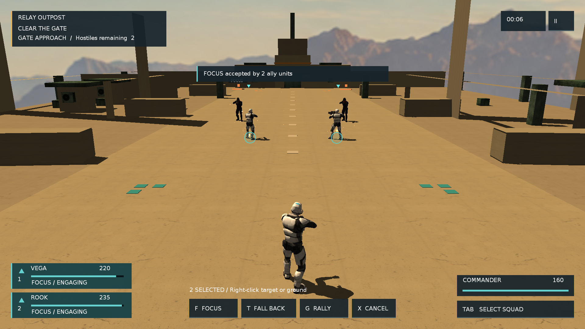
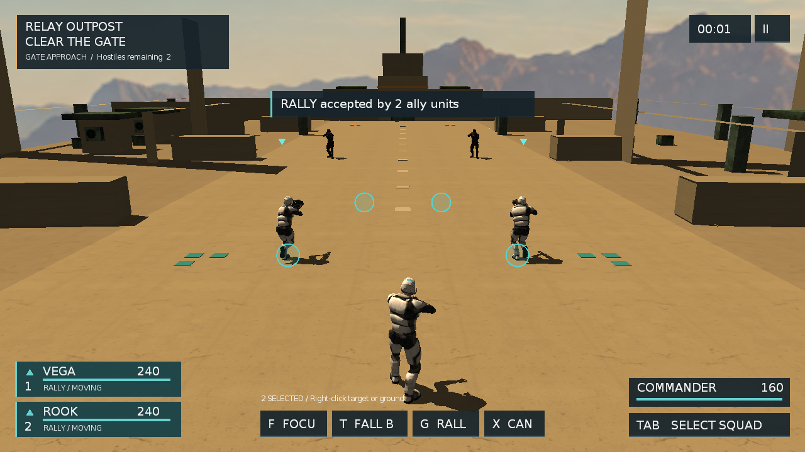

# Sandbox19 环境视觉深化设计

日期：2026-09-11
状态：已完成

## 目标

解决当前实机与已批准目标稿之间最显眼的环境差距：通用蓝天天空盒、连续重复墙片、方块化掩体、缺少远景纵深，以及平直材质导致的灰盒感。玩法锚点、两条导航路线、真实碰撞和现有 HUD 交互保持不变。

## 方案

### 荒漠天空与远景

使用专用 2:1 荒漠全景生成 Ogre 六面天空盒。远山、暖色地平线与空气透视直接进入背景层，不把远景做成参与导航或射线的假几何。六面图从同一全景转换，水平接缝先做环形混合；D3D9 实机检查朝向、接缝、地平线高度和资源加载。

### 院区轮廓

外围墙从连续双层重复窗片收缩为低矮单层边界，让远山越过围墙可见。入口两侧保留开放棚架；中段增加尺寸有差异的混凝土掩体和设备组；终点改成低翼楼、中央门厅、屋顶设备与桅杆组成的 relay 主体。主路 `x=-8..8`、西侧绕行 `x=-18` 和集合区不被装饰物占用。

### 表面与光照

混凝土使用已有 CC0 风化表面，设备保持低饱和灰绿，并用少量暖黄识别带建立层级。降低泛白环境光，保留暖色方向光和可读阴影。地面标记继续服从玩法信息，不用高亮几何替代环境细节。

## 资产与所有权

- 天空盒源全景和六面图位于 `media/textures/sandbox19/desert_sky/`，仅由 `Relay/Sky` 材质消费。
- 生成资产的日期、最终提示词和转换方式记录在同目录 `SOURCE.md`。
- 场景对象继续由 `SandboxObjects` / `ObjectManager` 管理；可碰撞建筑与掩体使用现有 `BlockObject`，不新增 C++ 或 Lua 绑定。

## 后台验证窗口

Windows D3D9 对完全隐藏的渲染 HWND 创建设备不稳定。`HELLO_WINDOW_BACKGROUND=1` 现在创建可渲染但不激活的无边框工具窗口：窗口位置落在整个虚拟桌面范围之外，扩展样式使用 `WS_EX_NOACTIVATE | WS_EX_TOOLWINDOW`，显示使用 `SW_SHOWNOACTIVATE`；启动器不再依赖 `Start-Process -WindowStyle Hidden`。后台模式同时跳过 OIS 物理输入初始化，合成回放仍从应用内部事件链进入。

## 验收

- 1920×1080 入口视角能同时看到主角、小队、门前敌人、分层 relay 和荒漠远山；不再由高墙与重复窗片占满天际线。
- 主要掩体呈矮墙、长箱或设备组轮廓，场地不再由等大立方体主导。
- 天空盒六面加载成功，目标相机范围内没有黑面、明显接缝或上下颠倒。
- Sandbox19 Lua 5.1 语法通过；导航、侧墙射线、主路无遮挡、地面碰撞和产品自测保持 PASS。
- 真实窗口截图与目标稿并列复核，仍缺失的定制模型、植被和材质能力继续留在 P3，不把本轮标记为最终美术完成。

## 实机结果

2026-09-11 Windows Release x64 构建为 0 错误。环境实现及 offscreen 修正后的 40 秒 smoke 均返回 `status=PASS`；最终日志记录 1280×800 窗口实际位于 `-3264,-864`，并包含 `hidden=false noActivate=true offscreen=true foregroundUnchanged=true`、`physical-input=disabled`、全部导航/碰撞 marker，以及 `[Sandbox19ProductSelfTest] PASS all=true synthetic=true`。1920×1080 和 1280×720 实机截图均正常加载六面天空纹理，D3D9 正常关闭。

本轮达到上述环境深化目标。角色、植被、定制建筑模型、PBR 材质和人工手感/听感仍属于 P3，不据本轮证据宣称最终美术或跨平台验收完成。
