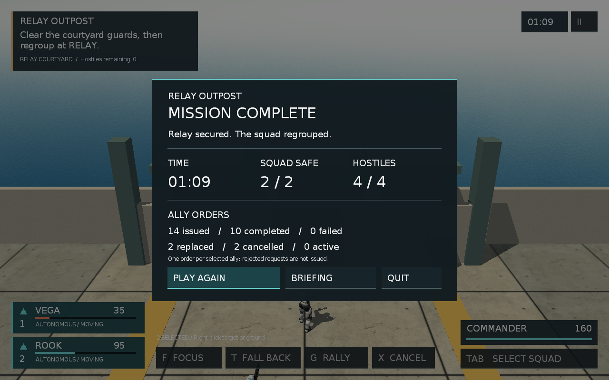
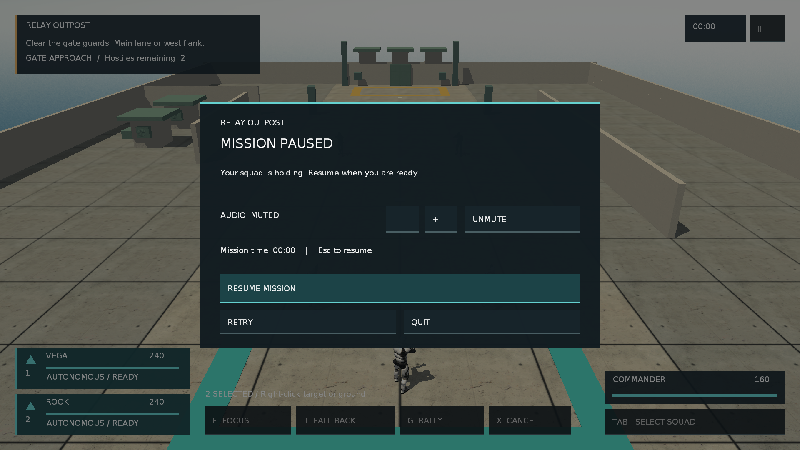
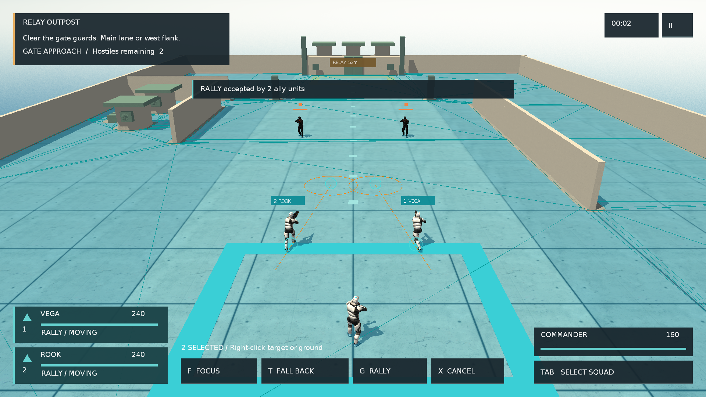

# Relay Outpost：实现与 Windows 验收

2026-09-10。对应 [联合计划](dev-design/plans/2026-09-10-sandbox19-product-experience.md)、[核心玩法](dev-design/specs/2026-09-10-sandbox19-core-loop.md) 和 [设计稿](dev-design/specs/2026-09-10-sandbox19-product-experience-design.md)。用户已集中批准 P0 方向。本记录区分真实游戏渲染、真实战斗加内部输入回放、人工操作和修改状态的合成自测。

## 实现结果

现有 Sandbox19 已改为中继站短任务：无武器指挥官、两名 AI 队友，两段各两名守卫。主动开始后依次清理入口、向庭院推进、清场、指挥官与至少一名队友集合；指挥官死亡或两名队友全灭失败。无自动回血、波间传送或强制接触导演。45 秒无击杀只提示重新部署，不伪造胜利或超时结算。

场景复用 Nobiax 模块和既有士兵，增加浅暖墙面、低饱和绿色设备、入口/目标区域及中线标记。西侧路线具有真实碰撞墙与可达导航。相机使用 12 米后距、9 米高度、6 米前视，WASD 沿相机平面移动，Q/E 转向、滚轮有限缩放。HUD 提供任务、两张队友卡、命令栏、目标和落点标记、暂停/声音设置、结算和重试；AI 观察器、路径与性能诊断默认隐藏。

集火、集结、撤回具有接受、实际 BT 执行、完成、失败、替换、取消语义。集火按每名执行者的当前视野检查，目标死亡完成、失去视野失败；移动到达完成，路径失败或无进展失败；入口撤回到达后守住。删除统一 8 秒 TTL，统计按每名队友的一次命令计数，拒绝请求不算 issued。暂停冻结仿真时钟、AI、物理和任务推进，并清除按住的移动/转向输入；UI 继续工作。

交火调试发现旧枪骨朝向在跑步转射击动画混合期间不能保证 9–10 米命中。新增 `ShootBulletAt(worldTarget)` 从真实枪口朝目标刚体中心发射，仍使用原 Bullet 弹丸、碰撞和每次 5 点伤害。仅 Sandbox19 通过 Blackboard 开关启用；同一开关关闭士兵动画事件的重复开火，Lua ShootAction 成为该模式唯一发射者。共享 sample 保留原发射路径。最终初始生命值为指挥官 160、队友各 240、敌人各 100。

## 设计兑现与差异

实际画面见下方。概念稿中浅暖环境、绿色设备、青色友军、琥珀任务标识与深色紧凑 HUD 已落入游戏。当前仍采用现有低多边形资产、Ogre D3D9 和 Gorilla 字体/UI，没有替换角色模型、引入 PBR/后处理或新 FGUI 资源包。既有 Gorilla 可可靠呈现和命中测试，因此本轮沿用并把业务拆为局部模块；不宣称概念图是运行截图。

声音使用项目内生成的九个简短 PCM WAV，经 runtime 单通道后端播放；支持音量、静音、保存和停止。它提供选择、指令、暂停、结果、射击/受击反馈，不是空间混音系统。后台测试静音，API 与资源读取已验，实际扬声器听感未验。

## 验证环境与版本

- Windows x64 / VS2017 Release / Direct3D9 / NVIDIA GeForce GTX 1050 Ti，FSAA 0、VSync 开启。1280×720、1280×800 和 1920×1080 使用实际渲染尺寸，不能用旧 cfg 中的设备名推定本机 GPU。
- 基础提交 `a1ed61f` 加本轮未提交工作区；preset `Sandbox19`、seed `20260710`、固定出生点。没有 commit/push。最终 exe 和资源 SHA-256 随独立包 `manifest.json` 保存；本地源码快照摘要另存 `tmp/product-runtime/source-sha256.json`。
- 新源文件已通过 Premake 重新生成 VS2017 工程；类布局调整后完成 Release clean rebuild，后续增量构建成功。日志 `tmp/product-runtime/rebuild-release.log`、`build-aimed-fire-final.log`、`build-background-final.log`。保留既有 Bullet/类型转换 warning；最终后台窗口改动未引入新 warning。
- macOS 分支、Objective-C++ 音频和 Premake AppKit 链接做源码核对；当前无 macOS 构建/图形环境，未标 PASS。

## 普通战斗与策略比较

所有以下对局均保持真实生命值、弹丸和 AI；输入来自标记 `synthetic=true` 的内部回放。与修改生命值/位置的 fixture 分开。策略变化包含部署位置与下令时机，属于小规模过程比较，不是胜率统计或严格单变量试验。

| 对局 | 过程与结果 | 本地日志 |
|---|---|---|
| 较深部署 | 24.222 秒清第一段，44.154 秒触发第二段；深入守卫之间后损失一名队友，另一名保留 80 HP，两名敌人仍在；90 秒脚本结束时仍僵持，未算自然结算 | `accepted-squad-runtime.log` |
| 保持距离 | 24.222 秒清第一段，44.154 秒触发第二段，58.674 秒清完全部守卫；队友均存活。第一次召回停在集合圈边缘，队友在圈外，正确保持 REGROUP | `final-victory-runtime.log` |
| 进入集合区 | 相同战斗部署后进入圈内召回，69.267 秒自然 VICTORY，存活 2/2、清敌 4/4，队友剩 35/95 HP；14 次单位命令分为完成 10、替换 2、终局取消 2；随后 Enter 重开产生新身份、重新进入第一段，暂停并正常退出，进程返回 0 | `final-complete-runtime.log` |

日志目录统一为 `tmp/product-runtime/`。`director=none`；未使用 `FORCE_CONTACT`。回放配方已保存在 [tools/replays/sandbox19-product](../tools/replays/sandbox19-product/README.md)。前期 160 HP 队友试验和枪骨瞄准失败属于调试历史，不与最终 240 HP 版本合并比较。

一次旧普通窗口独立包试跑清完守卫后发生 D3D9 device lost，记录于 `ranged-squad-device-lost.log`，未记为通过。后续从创建起隐藏的窗口复测单独记录，不据此断言所有设备丢失问题已解决。

## 自动检查与交互证据

| 层级 | 结果与证据 |
|---|---|
| Lua/preset/格式 | 本轮 12 个新增/修改 Lua 文件通过 Lua 5.1 `luac -p`；`tools/test_config_presets.lua` 全部 PASS；JSON、Python/PowerShell 语法、90 条文档链接、registry 源路径、CRLF 与 `git -c core.whitespace=cr-at-eol diff --check` 通过 |
| 产品合成 fixture | `tmp/relay-product-fixture-20260910-143150-iaeoiv1b/summary.json` 为 PASS；真实 BT 先 accepted 后 executing，覆盖导航到达、撤回守住、暂停、只读观察、超过旧 TTL、替换、取消幂等、目标失去/死亡、执行者死亡、推进/集合条件及两次重开清理 |
| 导航/碰撞 | 7 个出生点、目标/入口、主路与侧路分段/终点共 18 项可达检查；Bullet 两高度侧墙射线、主路无挡、地面碰撞通过。合成状态只用于 fixture；静态碰撞来自实际场景 |
| 720p 连续 UI | `ui-720-final-runtime.log` 及 248 张引擎帧：实际点击开始、1/2/Tab、拖框选两人、右键命令、暂停/恢复、T/G/X、Q 转向、滚轮、观察器、重开、UI 退出通过。暂停 4290ms 保持时钟、玩家与相机位置；退出来自 UI action=quit，正常 OGRE shutdown |
| 1080p/设置 | 独立包第一个进程通过 UI 从 65% 写为 75%/静音并退出；第二个进程以 1920×1080 读取为 MUTED，取消静音后显示 75%，降低后显示 65%，正常退出且文件为 `volume=0.65, muted=0`。`package-settings-write-runtime.log`、`ui-1080-final-runtime.log` 与截图保存；导航网格、实际路径/落点均可见，按钮点击和 E 转向生效 |
| 章节回归 | Sandbox6/7/8 各 20 秒 Release 后台 smoke PASS，日志 `regression-Sandbox6/7/8*.log`；Sandbox18 修正既有自测/runner 契约后严格 gate PASS，LayerPolicy、DirtyRegion、LayerSchema、DebugConfig 和 Chapter9 总体均 PASS、无 FAIL，日志 `regression-Sandbox18-verified*.log` |
| 系统物理输入/手感 | 未验。Computer Use 窗口截图接口报 `0x80004002`，初期激活无有效 OIS 事件；没有把返回成功当作操作成功。后续用户开始工作，所有测试均禁物理输入，未继续争用鼠标键盘 |

连续视频为 `tmp/RelayOutpost-input-demo-720p.mp4`，1280×720、10 fps、24.8 秒，直接按顺序编码引擎连续截图，无补帧、无声音。高频读回/PNG 写入改变墙钟耗时，且 RenderCapture 与输入回放时钟不同；视频用于看操作与画面，不用于声称正常游戏帧率。本轮保留 Tracy/性能入口，没有进行独立性能优化，也不报告无法比较的提升比例。

逐例读取 stdout、stderr 与 Sandbox.log。自然通关、设置/双尺寸最终用例无 Lua/绑定/材质编译错误；stderr 保留现有 Nobiax 和士兵旧 mesh 序列化版本警告，未为消除提示而批量升级 vendored 资源。

### 回归中修复的既有检查失配

Sandbox18 的 Lua 自测将 danger 配置摘要硬匹配到 `nav=default)`，C++ 早已在后面添加投影距离和计数器，因此配置正确仍会失败。首轮产生 553 条 `TacticalDebugConfigSmoke FAIL`、零条 Chapter9 总体 PASS；旧 runner 仅在显式 Chapter9 preset 时要求该门禁，通用失败正则也漏掉 Smoke FAIL，错误输出了总 PASS。本记录不认可该次 wrapper 结果。

局部修正 Lua：只提取 `danger(configured=...)` 的配置段，核对原有配置字段并允许后续统计字段；避免误取同名 layer policy 段。runner 对默认 Sandbox18（preset 为空或 Sandbox18 别名）启用既有 Chapter9 严格门禁，并捕获 `[...Smoke] FAIL`。历史失败日志用于验证新正则能捕获全部 553 项；Sandbox6/7/8 的原通过日志无此类失败。该修改只影响验证契约，没有修改战术算法或 C++ 摘要。

最终 20 秒复测 `regression-Sandbox18-verified.log` 为 `status=PASS lines=62`，逐项 PASS 与无 FAIL 已读取。Smoke 到时停止所属子进程，只证明章节运行与自测；正常退出证据来自 Relay 的独立对局/UI 用例。

## 后台运行与独立包

用户明确要求复跑不抢占工作窗口。Windows 普通 Ogre 窗口创建会调用显示窗口逻辑，单独 `Start-Process -WindowStyle Hidden` 不足。因此增加 `HELLO_WINDOW_BACKGROUND=1`：从创建起隐藏窗口、保持渲染、禁用 OIS 硬件输入；日志核验 `foregroundUnchanged=true`。`HELLO_WINDOW_WIDTH/HEIGHT` 指定后台像素尺寸，`HELLO_AUDIO_SILENT=1` 静音。常规启动保持原窗口行为；Play.cmd 清理测试变量供用户主动启动。

`tools/package_windows_playtest.ps1 -Archive` 只写新的输出目录，收集受版本管理资源和本轮明确新增文件，未触碰或纳入用户的 `bin/res/radar/`。包包含 Release exe、资源、许可、配置、Play.cmd、manifest 和 x64 D3DX9_43；资源配置拒绝绝对路径/越出包，其他 DLL 为 Windows 系统组件。本轮包从 checkout 外独立目录启动，完整资源加载通过。设置读写、重启、通关后重开及退出以最终日志为准。

本机交付：[Play.cmd](../tmp/RelayOutpost-win64-20260910-144057/Play.cmd)、[Windows ZIP](../tmp/RelayOutpost-win64-20260910-144057.zip)、[连续操作视频](../tmp/RelayOutpost-input-demo-720p.mp4)。ZIP 为 139,447,551 字节，350 个清单文件加 manifest；没有测试日志、声音偏好或用户 radar 资源。最终文件夹再次后台启动、暂停、正常退出返回 0（`delivery-check-runtime.log`），350 项 SHA-256 清单与工作区来源一致。

跨 checkout 通关和设置验证目录为 `%TEMP%/RelayOutpost-final-20260910-141803`。交付包同一 exe，另外包含最后的 Sandbox18 自测修正及文本 CRLF 统一；Relay 战斗逻辑未再改动。exe SHA-256 为 `7c110de2985619cafc6a291856328e6aa91338d60c745a051d4390b9cb25afe4`，ZIP SHA-256 为 `74c5c36ceb28b5391f7c03fd2b66f44a6d3103417887d00b9fe14c5b1957e23a`。完整静态摘要位于 `tmp/product-runtime/final-static-summary.json`。这些临时包/视频只在本机保留，源码与五张代表性真实截图位于仓库内。

包仅用于作者本机试玩。士兵遵守现有 DEXSOFT 许可，Nobiax 资源按既有来源说明；天空使用未改动的 Heiko Irrgang SkyboxSet TropicalSunnyDay，CC BY-SA 3.0，包内附原许可及署名。未对外发布。

## 保留边界

人工持续输入手感、实际音效听感、动态窗口调整、macOS 运行与跨设备适配未验；Windows 后台图像与内部事件链不能替代这些结论。历史长局 NaN 同源性也不因本轮短任务通过而关闭。作者可随时用 Play.cmd 主动试玩，后续调整依据真实反馈，不以自动化替代主观认可。
