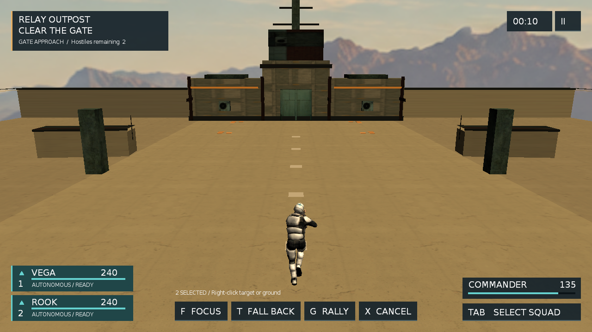
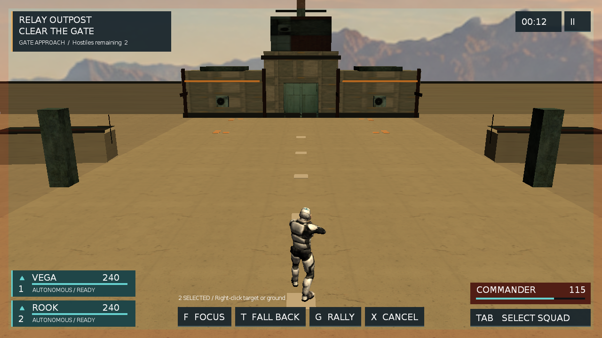
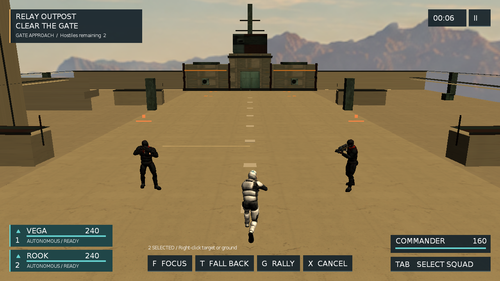

# Sandbox19 视觉收敛复盘（2026-09-11）

用户在查看 2026-09-10 的实机图后指出，当前效果与已批准目标稿仍有很大差距。这个判断成立：此前 P1 的 `[x]` 证明了场景、HUD 和交互的游戏内第一版已经可运行，没有证明画面已经接近目标完成度。本轮停止继续接入新的 AI 实验，先收敛相机、空间构图、材质和 HUD 比例。

## 对照结果

目标仍以 [设计稿](dev-design/specs/2026-09-10-sandbox19-product-experience-design.md) 中的构图、配色、信息层级和操作状态为准，不要求复制其中的新角色模型、远山、景深或 PBR 细节。

本轮实机画面相较 2026-09-10 版本完成了这些结构调整与环境深化：

- 跟随相机由 12 米后距、9 米高度、6 米前视改为 6.5 米后距、3.2 米相对高度、0 米前视；主角全身、两名队友、入口敌人和 relay 轮廓可同时出现，角色不再只是远处小点。
- 专用荒漠六面天空替换通用蓝天，远山、暖色地平线和空气透视形成不参与导航/射线的背景层；目标相机范围无黑面、明显接缝或上下颠倒。
- 连续双层重复墙片改为 2.4 米低边界，西侧实体遮挡与东侧服务墙改成长体块；近景保留单侧开放棚架，并用六组低矮长掩体替换等大立方体群。
- relay 终点改为低翼楼、中央门厅、屋顶设备和桅杆的分层轮廓，主路、西侧绕行和集合区保持开放。
- 将巨大的青色安全区方框换为四角短标记；路线和集合区只保留低强度短线，避免地面标识压过人物。
- 地面、墙体和掩体使用项目内风化混凝土表面，主材收敛为浅砂、暖灰和低饱和灰绿；降低环境光并保留暖色方向光和可读阴影。
- 队友头顶大卡改为小型青色三角；任务框、队友卡、命令栏和指挥官框缩短，并按屏幕宽度居中命令栏。1280×720 与 1920×1080 都保留至少 20 像素安全边距。

## 当前验收口径

| 目标 | 本轮结果 | 证据与边界 |
|---|---|---|
| 视野结构 | PASS | 1080p 集火图中场地占据主体，主角、两名队友、两名敌人与 relay 同屏；720p 主角全身与底部命令栏分离。 |
| 环境纵深与轮廓 | PASS | 1080p/720p 均可见荒漠远山、低墙、长条掩体和分层 relay；重复双层窗片与等大方块群已移除。 |
| 敌我与选择可读性 | PASS | 友军青色三角/圆环、敌方橙色菱形/生命条、目标框和短确认提示同时可见，形状与颜色双重区分。 |
| 材质与光照统一 | PARTIAL | 风化混凝土表面、三类主材和暖色日光已统一，D3D9 真实加载通过；旧低多边形模块、平直几何、贴图密度与目标稿仍有品质差距。 |
| HUD 层级与点击 | PASS | 720p 回放覆盖开始、选择/拖框、右键、暂停设置、三种命令、重试和退出；1080p 无裁切。 |
| 空间与玩法一致 | PASS | 七个出生点、目标/撤回点、主路/侧路共 18 项路径通过；侧墙两高度射线、主路无遮挡和地面碰撞通过。 |
| 本轮视觉收口 | PASS | relay 专用门面、结构边、信标与场地细节已落地；曳光、枪口焰、命中火花和 HP 差分受伤反馈在正常镜头下可辨认。 |
| 目标画面整体完成度 | PARTIAL | 核心构图和信息层级已经显著接近；角色/植被资产、PBR/后处理和最终声音/手感仍低于或尚未达到目标稿。 |

## 运行证据

- 视觉基线：`tmp/product-runtime/visual-gap-baseline-20260911/`；相机/HUD 迭代：`visual-gap-pass1-20260911/` 至 `visual-gap-pass5-20260911/`；环境迭代：`environment-visual-pass1-20260911/` 至 `environment-visual-pass6-background-20260911/`。
- 最终实机截图：1920×1080 位于 `tmp/product-runtime/environment-visual-pass6-background-20260911/`，1280×720 位于 `environment-visual-pass6-background-720-20260911/`；两次均加载完整环境并正常关闭 D3D9。
- Release x64 构建为 0 错误；环境实现与 offscreen 修正后的 `run_sandbox_smoke.ps1 -Sample Sandbox19 -Seconds 40 -NoTail` 均返回 `status=PASS`。最终后台日志记录 1280×800 窗口实际位于 `-3264,-864`，`hidden=false noActivate=true offscreen=true foregroundUnchanged=true` 且物理输入禁用；`[Sandbox19ArenaSelfTest]` 导航/碰撞（含新增长条掩体射线）全部 PASS，`[Sandbox19ProductSelfTest] PASS all=true synthetic=true`。
- 扩展的真实战斗输入回放没有 fixture、改血或传送：82.236 秒清敌进入 REGROUP，99.297 秒自然 VICTORY，两名队友存活，`director=none`，随后 D3D9 正常关闭。日志在 `tmp/product-runtime/visual-gap-current-natural-extended-20260911-runtime.log`。
- Lua 5.1 语法、材质/模型/天空六面加载与 `git diff --check` 通过。后台窗口适配涉及 C++，已重新构建 Windows Release x64。
- 提交后复核发现 1280 宽命令按钮的固定宽度没有计入 12 像素左右文字边距，实机被截成 `F FOCU / T FALL B / G RALL / X CAN`；现已按 Gorilla 14px 字形 advance 加宽四个按钮并替换上方 720p 实机图，完整标签与两侧 HUD 间距通过离屏抓帧复核。
- 选中圈和移动落点原为世界坐标投影后的屏幕 UI 圆形，大小与朝向不受相机透视影响。现改为深度检测的世界空间圆环：选中圈跟随 agent 脚点，移动落点跟随两名队员各自的编队位置并带中心十字；`world-rings-720-pass3-20260911` 的 720p 回放确认移动中贴地、命令完成后落点消失。

## P3 视觉体验收口追加

环境结构完成后仍有三个直接影响正常游玩画面的缺口：relay 正面像程序方块，战斗弹道/命中瞬间太弱，HUD 不能立即区分谁正在受伤。本轮在不改玩法、路径和碰撞合同的前提下完成对应收口。

- relay 三段主体换用项目专用 `relay_facade_diffuse.png`，新增深色结构框、基座/檐口、门体设备、屋顶横梁和青/琥珀信标；外围墙、侧墙和六组掩体补压顶，沿路线增加少量设备，所有新增静态碰撞均嵌入原有实体或位于非行走区域。
- 主光方向改为朝 relay 和主要交战面照射，降低环境光，保留暖色天空同时恢复建筑正面和角色轮廓的明暗层次。
- `Bullet` 使用短寿命、世界空间粒子留下细曳光；`BulletImpact` 改成可读的暖色火花；真实 `WeaponComponent::DoShootBullet` 入口同时触发短枪口焰，效果服务于所有既有武器路径，Sandbox6/7/8 回归通过。
- Sandbox19 每帧只比较指挥官与两名队友的真实 HP 样本：下降时显示 220ms 反馈，指挥官使用四边弱红闪和状态卡变色，队友只闪对应卡片；暂停/结算清掉反馈计时，重开同时清空采样，不从声音、动画或结果反推伤害。

### 本轮证据与限制

- `bash xcode.sh` 生成工程成功，macOS arm64 Release 完整构建及加入枪口焰后的增量构建通过。
- 最终 `python3 tools/run_sandbox19_stability.py --product-fixture --timeout 90` 返回 `status=PASS reason=evidence-complete`，摘要位于 `tmp/relay-product-fixture-20260911-233131-rp7dw2r3/summary.json`；它是合成 fixture，不证明自然通关、外部输入或人工手感。
- 最终 `python3 tools/run_m1_smoke.py --samples Sandbox19 Sandbox6 Sandbox7 Sandbox8 --seconds 20` 四个 sample 全部 PASS，日志位于 `tmp/m1-smoke-20260911-233154/`。Sandbox19 日志记录 Apple M1 Pro / OpenGL 4.1、1280×720，以及新 1024×1024 facade 纹理实际加载。
- 当前机器没有 Lua 5.1 可执行文件；三个改动脚本由 `/usr/local/bin/luac` 5.3 解析通过。这不能替代严格的 5.1 parser 证据，但最终程序内嵌 Lua 5.1 已实际加载并执行这些脚本，产品 fixture 与 smoke 均未报 Lua 错误。
- Apple 普通窗口路径目前在 `ClientManager` 中固定为 1280×720，`HELLO_WINDOW_WIDTH/HEIGHT` 只作用于 Windows 后台窗口，所以本轮没有新的 macOS 1920×1080 图；此前 Windows D3D9 1080p 布局证据仍有效。动态窗口调整、人工持续输入、扬声器听感、角色/植被替换和 PBR/后处理继续单列。

当前渲染链内可兑现的 P3 视觉收口已经完成；后续只有在引入定制角色/植被或扩展渲染能力时，才继续追逐目标稿中的资产与 PBR 细节。P3 总体验仍保留人工手感、听感和动态窗口等独立验收边界。
